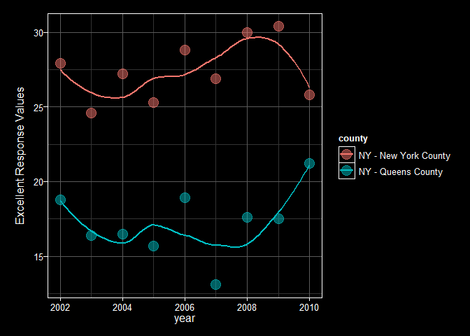

HW2 p8105 James Dalgleish jld2227
================
James Dalgleish
September 27, 2018

#### Problem 1

Instructions(I'm choosing to include these to make it a bit easier to grade): "Read and clean the data; retain line, station, name, station latitude / longitude, routes served, entry, vending, entrance type, and ADA compliance. Convert the entry variable from character (YES vs NO) to a logical variable (the ifelse or recode function may be useful)."

``` r
subway_data = read_csv("./problem1/NYC_Transit_Subway_Entrance_And_Exit_Data.csv") %>%
  janitor::clean_names() %>% 
  select(c("line", "station_name", "station_latitude", "station_longitude",
           starts_with("route"), "entry", "vending", "ada")) %>% 
  mutate(entry = recode(entry, "YES" = TRUE, "NO" = FALSE))
```

    ## Parsed with column specification:
    ## cols(
    ##   .default = col_character(),
    ##   `Station Latitude` = col_double(),
    ##   `Station Longitude` = col_double(),
    ##   Route8 = col_integer(),
    ##   Route9 = col_integer(),
    ##   Route10 = col_integer(),
    ##   Route11 = col_integer(),
    ##   ADA = col_logical(),
    ##   `Free Crossover` = col_logical(),
    ##   `Entrance Latitude` = col_double(),
    ##   `Entrance Longitude` = col_double()
    ## )

    ## See spec(...) for full column specifications.

``` r
subway_data 
```

    ## # A tibble: 1,868 x 18
    ##    line  station_name station_latitude station_longitu~ route1 route2
    ##    <chr> <chr>                   <dbl>            <dbl> <chr>  <chr> 
    ##  1 4 Av~ 25th St                  40.7            -74.0 R      <NA>  
    ##  2 4 Av~ 25th St                  40.7            -74.0 R      <NA>  
    ##  3 4 Av~ 36th St                  40.7            -74.0 N      R     
    ##  4 4 Av~ 36th St                  40.7            -74.0 N      R     
    ##  5 4 Av~ 36th St                  40.7            -74.0 N      R     
    ##  6 4 Av~ 45th St                  40.6            -74.0 R      <NA>  
    ##  7 4 Av~ 45th St                  40.6            -74.0 R      <NA>  
    ##  8 4 Av~ 45th St                  40.6            -74.0 R      <NA>  
    ##  9 4 Av~ 45th St                  40.6            -74.0 R      <NA>  
    ## 10 4 Av~ 53rd St                  40.6            -74.0 R      <NA>  
    ## # ... with 1,858 more rows, and 12 more variables: route3 <chr>,
    ## #   route4 <chr>, route5 <chr>, route6 <chr>, route7 <chr>, route8 <int>,
    ## #   route9 <int>, route10 <int>, route11 <int>, entry <lgl>,
    ## #   vending <chr>, ada <lgl>

###### Data description

Instruction: "Write a short paragraph about this dataset – explain briefly what variables the dataset contains, describe your data cleaning steps so far, and give the dimension (rows x columns) of the resulting dataset. Are these data tidy?"

Essentially, the dataset contains two character variables dening the subway line and station, two numeric (double) variables denoting geolocation (latitude and longitude), 11 variables denoting the routes (mostly populated with missing values) in a wide format, two logical TRUE/FALSE variables for entry and ada, and a character variable with values "YES" and "NO" variable for vending. The data is not tidy for at least the reasons that routes are in a wide format where the route is encoded in the column. This can be remedied with the gather function. As we'll see below, route1 was been encoded in mixed case(see the "E" and "e"?), which may mess up some downstream analysis as well.

The dataset contains 1868 rows and 18 columns. Data cleaning included reading the data into a tibble, selecting the necessary columns, converting the column names into a standard format, and converting the entry variable into a logical column.

``` r
skimr::skim( subway_data )
```

    ## Skim summary statistics
    ##  n obs: 1868 
    ##  n variables: 18 
    ## 
    ## -- Variable type:character ----------------------------------------------------------------------------------------------
    ##      variable missing complete    n min max empty n_unique
    ##          line       0     1868 1868   5  17     0       36
    ##        route1       0     1868 1868   1   2     0       24
    ##        route2     848     1020 1868   1   2     0       20
    ##        route3    1374      494 1868   1   2     0       18
    ##        route4    1547      321 1868   1   1     0       13
    ##        route5    1630      238 1868   1   1     0       12
    ##        route6    1741      127 1868   1   1     0        7
    ##        route7    1788       80 1868   1   2     0        7
    ##  station_name       0     1868 1868   4  39     0      356
    ##       vending       0     1868 1868   2   3     0        2
    ## 
    ## -- Variable type:integer ------------------------------------------------------------------------------------------------
    ##  variable missing complete    n mean   sd p0 p25 p50 p75 p100     hist
    ##   route10    1845       23 1868 3    0     3   3   3   3    3 <U+2581><U+2581><U+2581><U+2587><U+2581><U+2581><U+2581><U+2581>
    ##   route11    1845       23 1868 7    0     7   7   7   7    7 <U+2581><U+2581><U+2581><U+2587><U+2581><U+2581><U+2581><U+2581>
    ##    route8    1820       48 1868 2.98 1.94  1   1   4   5    5 <U+2587><U+2581><U+2581><U+2581><U+2581><U+2582><U+2581><U+2587>
    ##    route9    1840       28 1868 2.54 1.17  2   2   2   2    5 <U+2587><U+2581><U+2581><U+2581><U+2581><U+2581><U+2581><U+2582>
    ## 
    ## -- Variable type:logical ------------------------------------------------------------------------------------------------
    ##  variable missing complete    n mean                      count
    ##       ada       0     1868 1868 0.25 FAL: 1400, TRU: 468, NA: 0
    ##     entry       0     1868 1868 0.94 TRU: 1753, FAL: 115, NA: 0
    ## 
    ## -- Variable type:numeric ------------------------------------------------------------------------------------------------
    ##           variable missing complete    n   mean    sd     p0    p25    p50
    ##   station_latitude       0     1868 1868  40.73 0.07   40.58  40.69  40.73
    ##  station_longitude       0     1868 1868 -73.94 0.057 -74.03 -73.99 -73.96
    ##     p75   p100     hist
    ##   40.77  40.9  <U+2582><U+2582><U+2585><U+2587><U+2587><U+2582><U+2583><U+2582>
    ##  -73.91 -73.76 <U+2583><U+2587><U+2585><U+2583><U+2582><U+2581><U+2581><U+2581>

``` r
subway_data %>% 
  select(starts_with( "route" )) %>%
  sapply(., table)
```

    ## $route1
    ## 
    ##   1   2   3   4   5   6   7   A   B   C   D   e   E   F  FS   G  GS   H 
    ## 146 138  32  61   7 113  70 273 193  47  52   1  75 177   7  50  16  12 
    ##   J   L   M   N   Q   R 
    ##  93  74  53 101   6  71 
    ## 
    ## $route2
    ## 
    ##   1   2   3   4   5   B   C   D   E   F  FS   G   H   J   L   M   N   Q 
    ##  11  43  42  27 121  35 190 120  24  26   1  21   1  20  26  59  32 103 
    ##   R   Z 
    ##  75  43 
    ## 
    ## $route3
    ## 
    ##  1  3  4  5  6  7  C  D  E  F FS  G  J  M  N  Q  R  Z 
    ##  3 43 31 20 29  2 35  4 76 75  4  2 21 46  3 27 49 24 
    ## 
    ## $route4
    ## 
    ##  1  2  4  5  6  7  D  L  M  N  Q  R  Z 
    ## 21 17 28 15 16  7 35 11 55 27  3 60 26 
    ## 
    ## $route5
    ## 
    ##  1  2  3  4  5  6  7  E  N  Q  R  Z 
    ## 17 41 17 12 28 23 37  6 14 23  5 15 
    ## 
    ## $route6
    ## 
    ##  2  3  5  6  F  Q  R 
    ##  5 41 12 26  6 14 23 
    ## 
    ## $route7
    ## 
    ##  3  4  6 GS  M  R  S 
    ##  5 20 12  1  6 14 22 
    ## 
    ## $route8
    ## 
    ##  1  4  5 
    ## 23  5 20 
    ## 
    ## $route9
    ## 
    ##  2  5 
    ## 23  5 
    ## 
    ## $route10
    ## 
    ##  3 
    ## 23 
    ## 
    ## $route11
    ## 
    ##  7 
    ## 23

Putting the wide format into long could aid analysis and can be done with a simple gather command. We'll also get rid of names that appear to be the same, but differ only on case. There are stations with FS and GS lines, but which might seem like more than one line in a single observation, but they are distinct lines if one looks an MTA licensed site: <https://moveonmap.com/nyc/lnG_GS_FS/> If they were F and S incorrectly noted in the same row, we could consider using separate\_rows() to fix that. We'll use the table function to show that we've now fixed the lower and upper case e.

``` r
subway_data_long = subway_data %>% 
  gather(key = "route_number", value = "train", route1:route11) %>% 
  mutate(train = tolower(train))
subway_data_long
```

    ## # A tibble: 20,548 x 9
    ##    line  station_name station_latitude station_longitu~ entry vending ada  
    ##    <chr> <chr>                   <dbl>            <dbl> <lgl> <chr>   <lgl>
    ##  1 4 Av~ 25th St                  40.7            -74.0 TRUE  YES     FALSE
    ##  2 4 Av~ 25th St                  40.7            -74.0 TRUE  YES     FALSE
    ##  3 4 Av~ 36th St                  40.7            -74.0 TRUE  YES     FALSE
    ##  4 4 Av~ 36th St                  40.7            -74.0 TRUE  YES     FALSE
    ##  5 4 Av~ 36th St                  40.7            -74.0 TRUE  YES     FALSE
    ##  6 4 Av~ 45th St                  40.6            -74.0 TRUE  YES     FALSE
    ##  7 4 Av~ 45th St                  40.6            -74.0 TRUE  YES     FALSE
    ##  8 4 Av~ 45th St                  40.6            -74.0 TRUE  YES     FALSE
    ##  9 4 Av~ 45th St                  40.6            -74.0 TRUE  YES     FALSE
    ## 10 4 Av~ 53rd St                  40.6            -74.0 TRUE  YES     FALSE
    ## # ... with 20,538 more rows, and 2 more variables: route_number <chr>,
    ## #   train <chr>

``` r
subway_data_long %>% 
  pull(train) %>% 
  table()
```

    ## .
    ##   1   2   3   4   5   6   7   a   b   c   d   e   f  fs   g  gs   h   j 
    ## 221 267 203 184 228 219 139 273 228 272 211 182 284  12  73  17  13 134 
    ##   l   m   n   q   r   s   z 
    ## 111 219 177 176 297  22 108

####### Distinct stations

Instruction: "Answer the following questions using these data:

How many distinct stations are there? Note that stations are identified both by name and by line (e.g. 125th St A/B/C/D; 125st 1; 125st 4/5); the distinct function may be useful here. How many stations are ADA compliant? What proportion of station entrances / exits without vending allow entrance?"

We'll now select the columns of interest and limit to only the distinct rows, then count the number of distinct rows containing route number and train combinations.

``` r
subway_routes_trains <- subway_data_long %>%
  select("route_number", "train") %>%
  distinct() %>% 
  na.omit() %>% 
  arrange(route_number,train)
subway_routes_trains
```

    ## # A tibble: 107 x 2
    ##    route_number train
    ##    <chr>        <chr>
    ##  1 route1       1    
    ##  2 route1       2    
    ##  3 route1       3    
    ##  4 route1       4    
    ##  5 route1       5    
    ##  6 route1       6    
    ##  7 route1       7    
    ##  8 route1       a    
    ##  9 route1       b    
    ## 10 route1       c    
    ## # ... with 97 more rows

``` r
nrow(subway_routes_trains)
```

    ## [1] 107

There happen to be 107 distinct stations, according to the data.

####### Ada compliance

We will create an additional variable denoting if the station ada is compliant. There can be multiple entrances, only some of which are ada compliant. As a simple rule, a station is compliant if there is at least one station name/line combination with an ada compliant entrance, then it is ada compliant.

``` r
ada_accessible_stations <- subway_data_long %>%
  select("route_number", "train", "ada") %>% 
  filter(ada == TRUE) %>%
  distinct(route_number, train, .keep_all = TRUE) %>% 
  na.omit %>% 
  arrange(route_number, train)
ada_accessible_stations
```

    ## # A tibble: 88 x 3
    ##    route_number train ada  
    ##    <chr>        <chr> <lgl>
    ##  1 route1       1     TRUE 
    ##  2 route1       2     TRUE 
    ##  3 route1       3     TRUE 
    ##  4 route1       4     TRUE 
    ##  5 route1       6     TRUE 
    ##  6 route1       7     TRUE 
    ##  7 route1       a     TRUE 
    ##  8 route1       b     TRUE 
    ##  9 route1       c     TRUE 
    ## 10 route1       d     TRUE 
    ## # ... with 78 more rows

####### Station entrances/exists that without vending which allow entry.

Instruction: "What proportion of station entrances / exits without vending allow entrance?" The original form "contains information related to each entrance and exit for each subway station in NYC." So, we will use this format to answer a question about entrances. Careful verification through subsetting for duplicate locations reveals that this is the case. Even looking at the latitude and longitude of the entrance does not distinctly identify the station. In some cases, there is a different kind of entrance (elevator/escalator) or the station is located on a different corner of an intersection. Converting wide to long as before could mislead someone to thinking that there are more entrances than exist in cases where the entrance services multiple routes. Therefore, the way to solve this problem is simple... read the original data in with minimal processing, filter on the vending and entry criteria, then count the number of rows. Using the distinct function can prove again, that the rows are distinct.

``` r
subway_ent_exit_locations = read_csv(
  "./problem1/NYC_Transit_Subway_Entrance_And_Exit_Data.csv") %>%
  janitor::clean_names() #read data and clean names
```

    ## Parsed with column specification:
    ## cols(
    ##   .default = col_character(),
    ##   `Station Latitude` = col_double(),
    ##   `Station Longitude` = col_double(),
    ##   Route8 = col_integer(),
    ##   Route9 = col_integer(),
    ##   Route10 = col_integer(),
    ##   Route11 = col_integer(),
    ##   ADA = col_logical(),
    ##   `Free Crossover` = col_logical(),
    ##   `Entrance Latitude` = col_double(),
    ##   `Entrance Longitude` = col_double()
    ## )

    ## See spec(...) for full column specifications.

``` r
subway_ent_exit_locations %>% 
  distinct()  %>% 
  nrow()
```

    ## [1] 1868

``` r
subway_ent_exit_locations %>% 
  nrow()
```

    ## [1] 1868

``` r
duplicated_locations<-subway_ent_exit_locations %>%
  filter(duplicated(entrance_location)) %>% 
  pull(entrance_location)
duplicated_locations_subset<-subway_ent_exit_locations %>% 
  filter(entrance_location %in% duplicated_locations) %>% 
  arrange()
enterable_novend <- subway_ent_exit_locations %>% 
  filter(.,vending == "NO" & entry == "YES") #filter the subway openings for enterable locations with vending.
enterable_novend %>% 
  nrow() 
```

    ## [1] 69

``` r
n_enterable_novend <- enterable_novend %>% 
  distinct() %>% 
  nrow() #count the number of enterable locations with vending.
enterable_novend_prop =  n_enterable_novend / nrow(subway_ent_exit_locations)
#divide the count of the enterable locations with vending by the total number of openings

n_novend <- subway_ent_exit_locations %>% 
  filter(.,vending == "NO") %>% 
  nrow()

prop_enterable_of_novend = n_enterable_novend / n_novend
```

The number of distinct enterable subway entrances/exits without vending is therefore 69. The proportion of such stations out of the total is 0.0369379. If one wants the proportion of openings that are enterable of all the openings without vending (another way of looking at this question): 0.3770492.

Instruction: "Reformat data so that route number and route name are distinct variables. How many distinct stations serve the A train? How many are ADA compliant?"

First we'll tackle the number of distinct A train stations. We've done most of the work by using gather() earlier. The problem description's route name I have chosen to call train (the value argument in gather). I will change the name to make this clearer for the reader.

``` r
subway_data_long_a = subway_data %>% 
  gather(key = "route_number",
  value = "route_name",route1:route11) %>% 
  mutate(line = tolower(line))   %>% 
  filter(route_name == "A") %>% 
  distinct(station_name,line) %>%
  arrange(station_name,line)
subway_data_long_a
```

    ## # A tibble: 60 x 2
    ##    line             station_name                 
    ##    <chr>            <chr>                        
    ##  1 liberty          104th St-Oxford Av           
    ##  2 liberty          111th St-Greenwood Av        
    ##  3 8 avenue         125th St                     
    ##  4 8 avenue         145th St                     
    ##  5 8 avenue         14th St                      
    ##  6 broadway-7th ave 168th St                     
    ##  7 8 avenue         168th St - Washington Heights
    ##  8 8 avenue         175th St                     
    ##  9 8 avenue         181st St                     
    ## 10 8 avenue         190th St                     
    ## # ... with 50 more rows

It becomes clear now that there are precicsely 60 stations that service the A train.

Finally, how many are ada compliant follows a nearly identical process using the filter function.

``` r
subway_data_long_ada = subway_data %>% 
  gather(key = "route_number", value = "route_name", route1:route11) %>% 
  filter(ada == TRUE) %>% 
  mutate(line = tolower(line))   %>% 
  distinct(station_name, line) %>%
  arrange(station_name, line)
subway_data_long_ada
```

    ## # A tibble: 84 x 2
    ##    line              station_name                 
    ##    <chr>             <chr>                        
    ##  1 lexington         125th St                     
    ##  2 lenox             135th St                     
    ##  3 white plains road 149th St-3rd Av              
    ##  4 8 avenue          14th St                      
    ##  5 8 avenue          168th St - Washington Heights
    ##  6 8 avenue          175th St                     
    ##  7 63rd street       21st St                      
    ##  8 broadway-7th ave  231st St                     
    ##  9 white plains road 233rd St                     
    ## 10 flushing          34 St Hudson Yards           
    ## # ... with 74 more rows

It becomes clear now that there are precicsely 84 stations where there is an accessible entrance. Assuming one entrance is sufficent for compliance per station, then this represents the number of accessible stations.

#### Problem 2

instruction: "Read and clean the Mr. Trash Wheel sheet:

*specify the sheet in the Excel file and to omit columns containing notes (using the range argument and cell\_cols() function) *use reasonable variable names *omit rows that do not include dumpster-specific data *rounds the number of sports balls to the nearest integer and converts the result to an integer variable (using as.integer)"

"Read and clean precipitation data for 2016 and 2017. For each, omit rows without precipitation data and add a variable year. Next, combine datasets and convert month to a character variable (the variable month.name is built into R and should be useful)."

I've chosen to read in the data, specify the sheet, columns, drop the total rows (which typically have NA in dumpster), and removed any row without a month that matches base-r's month names constants. This means that if the month isn't one of "January", "February", or any of the other ones, the row is removed. One line has an incorrect year (the 1/2/2017 entry). This, along with the empty yeared rows near the end of the table, as indicated by missmap, will be corrected by reassigning the year. lubridate::year() can be used instead of format() and as.integer(), I've chosen to use missmap to show that I've fixed the missing values correctly. read\_excel doesn't convert to a tibble, so I've chosen to do that for purposes of display.

``` r
trash_wheel_data <- readxl::read_excel(path = 
    "./problem2/HealthyHarborWaterWheelTotals2018-7-28.xlsx",
  sheet =  "Mr. Trash Wheel",
  range = readxl::cell_cols("A:N")) %>% 
  janitor::clean_names() %>% 
  drop_na(dumpster) %>% 
  filter( month %in% month.name) %>% 
  mutate( year = lubridate::year(date),
    sports_balls = round(sports_balls) %>%
            as.integer()) %>% 
  as.tibble()
 trash_wheel_data
```

    ## # A tibble: 285 x 14
    ##    dumpster month  year date                weight_tons volume_cubic_ya~
    ##       <dbl> <chr> <dbl> <dttm>                    <dbl>            <dbl>
    ##  1        1 May    2014 2014-05-16 00:00:00        4.31               18
    ##  2        2 May    2014 2014-05-16 00:00:00        2.74               13
    ##  3        3 May    2014 2014-05-16 00:00:00        3.45               15
    ##  4        4 May    2014 2014-05-17 00:00:00        3.1                15
    ##  5        5 May    2014 2014-05-17 00:00:00        4.06               18
    ##  6        6 May    2014 2014-05-20 00:00:00        2.71               13
    ##  7        7 May    2014 2014-05-21 00:00:00        1.91                8
    ##  8        8 May    2014 2014-05-28 00:00:00        3.7                16
    ##  9        9 June   2014 2014-06-05 00:00:00        2.52               14
    ## 10       10 June   2014 2014-06-11 00:00:00        3.76               18
    ## # ... with 275 more rows, and 8 more variables: plastic_bottles <dbl>,
    ## #   polystyrene <dbl>, cigarette_butts <dbl>, glass_bottles <dbl>,
    ## #   grocery_bags <dbl>, chip_bags <dbl>, sports_balls <int>,
    ## #   homes_powered <dbl>

Instruction: "Read and clean precipitation data for 2016 and 2017. For each, omit rows without precipitation data and add a variable year. Next, combine datasets and convert month to a character variable (the variable month.name is built into R and should be useful)." An import of both sheets followed by a merge is done below.

``` r
#I was instructed by a TA to put in some inline comments, for ease of grading.
precip_2017 <- readxl::read_excel(path = 
    "./problem2/HealthyHarborWaterWheelTotals2018-7-28.xlsx", 
    #This reads the excel sheet.
  sheet =  "2017 Precipitation", #This specifies sheet
  skip = 2, col_names = c("month", "tot_precip")) %>% 
  #skip rows w/o data, limit to a pair of columns
  na.omit() %>%  #get rid of any rows containing empty cells.
  as.tibble() %>% #This converts to tibble format
  mutate(year = 2017) #Here, we add a year variable.
#We follow the same steps for the 2016 dataset
precip_2016 <- readxl::read_excel(path = 
    "./problem2/HealthyHarborWaterWheelTotals2018-7-28.xlsx",
  sheet =  "2016 Precipitation", 
  skip = 2,
  col_names = c("month", "tot_precip")) %>% 
  na.omit() %>% 
  as.tibble() %>% 
  mutate(year = 2016)
#Below we combine datasets vertically.
precip_2017_2016 <- dplyr::bind_rows(precip_2016, precip_2017) %>% 
  mutate(month = month.name[month])

avg_wt_removed_yr <- trash_wheel_data %>% 
  group_by(year) %>% #This converts the df to a df grouped by year.
  summarise(sum = sum(weight_tons)) %>% 
  pull(sum) %>% 
  mean()
homes_yr_sd <- trash_wheel_data %>%
  group_by(year) %>%
  summarise(sum = sum(homes_powered)) %>%
  filter(year != 2014) %>% 
  pull(sum) %>%  sd()
homes_yr_mean <- trash_wheel_data %>%
  group_by(year) %>%
  summarise(sum = sum(homes_powered)) %>%
  filter(year != 2014) %>% 
  pull(sum) %>%  mean()
prcp_16_17_tot <- precip_2017 %>% 
  pull(tot_precip) %>%
  sum()
med_sports_balls <- trash_wheel_data %>% 
  pull(sports_balls) %>% 
  median()
```

Instruction:"Write a paragraph about these data; you are encouraged to use inline R. Be sure to note the number of observations in both resulting datasets, and give examples of key variables."

The number of observations in the trash wheel data was 285 and 24 observations in the precipitation data. The key variables might be the more reportable effects the intervention had on the environment, namely the average trash removed per year , 186.988 tons, or the postitive outcomes outside of trash removal, namely the average homes powered per year, 2987.6666667 homes along with it's minimal standard deviation 417.2256473 homes during years where this variable has a measured value (not 2014).

Instruction: " For available data, what was the total precipitation in 2017? What was the median number of sports balls in a dumpster in 2016?" The total precipitation in 2017 was 32.93 inches. The median number of sports balls was 8.

Problem 3
=========

"This problem uses the BRFSS data. DO NOT include this dataset in your local data directory; instead, load the data from the p8105.datasets package.

For this question:

format the data to use appropriate variable names; focus on the “Overall Health” topic exclude variables for class, topic, question, sample size, and everything from lower confidence limit to GeoLocation structure data so that responses (excellent to poor) are variables taking the value of Data\_value create a new variable showing the proportion of responses that were “Excellent” or “Very Good”"

``` r
brfss <- p8105.datasets::brfss_smart2010 %>% janitor::clean_names() %>% 
  filter(topic == "Overall Health") %>% 
  select(-class,-topic,-question,-sample_size,-(confidence_limit_low:geo_location)) %>% 
    spread(key = response,value=data_value) %>%
   janitor::clean_names() %>%
  mutate(ex_very_good = excellent + very_good)
brfss  
```

    ## # A tibble: 2,125 x 9
    ##     year locationabbr locationdesc excellent  fair  good  poor very_good
    ##    <int> <chr>        <chr>            <dbl> <dbl> <dbl> <dbl>     <dbl>
    ##  1  2002 AK           AK - Anchor~      27.9   8.6  23.8   5.9      33.7
    ##  2  2002 AL           AL - Jeffer~      18.5  12.1  32.7   5.9      30.9
    ##  3  2002 AR           AR - Pulask~      24.1  12.5  29.9   4.2      29.3
    ##  4  2002 AZ           AZ - Marico~      21.6  10.3  26.9   4.6      36.6
    ##  5  2002 AZ           AZ - Pima C~      26.6   7.5  31.9   3.9      30.1
    ##  6  2002 CA           CA - Los An~      22.7  14.3  28.7   4.5      29.8
    ##  7  2002 CO           CO - Adams ~      21.2  14.4  29     4.2      31.2
    ##  8  2002 CO           CO - Arapah~      25.5   8    29.3   2.1      35.2
    ##  9  2002 CO           CO - Denver~      22.2  11.1  36.6   3        27.1
    ## 10  2002 CO           CO - Jeffer~      23.4  11.4  26.3   2.4      36.6
    ## # ... with 2,115 more rows, and 1 more variable: ex_very_good <dbl>

Instruction: "Using this dataset, do or answer the following:

How many unique locations are included in the dataset? Is every state represented? What state is observed the most? In 2002, what is the median of the “Excellent” response value? Make a histogram of “Excellent” response values in the year 2002. Make a scatterplot showing the proportion of “Excellent” response values in New York County and Queens County (both in NY State) in each year from 2002 to 2010." \#\#\#\#\#\# Number of unique locations in dataset

``` r
unique_locations <- brfss %>%
  select( locationdesc ) %>%
  distinct() %>%
  nrow()
unique_locations
```

    ## [1] 404

``` r
n_states <- brfss %>%
  select( locationabbr ) %>%
  distinct() %>%
  nrow() 
n_states
```

    ## [1] 51

``` r
all_states <- brfss %>%
  select( locationabbr ) %>%
  distinct() %>% 
  table() %>% 
  names()
all_states
```

    ##  [1] "AK" "AL" "AR" "AZ" "CA" "CO" "CT" "DC" "DE" "FL" "GA" "HI" "IA" "ID"
    ## [15] "IL" "IN" "KS" "KY" "LA" "MA" "MD" "ME" "MI" "MN" "MO" "MS" "MT" "NC"
    ## [29] "ND" "NE" "NH" "NJ" "NM" "NV" "NY" "OH" "OK" "OR" "PA" "RI" "SC" "SD"
    ## [43] "TN" "TX" "UT" "VA" "VT" "WA" "WI" "WV" "WY"

``` r
most_observed_states <- brfss %>% 
  select( locationabbr ) %>% 
  table() %>% 
  sort(decreasing = T) %>% 
  head()
most_observed_states
```

    ## .
    ##  NJ  FL  NC  WA  MD  MA 
    ## 146 122 115  97  90  79

``` r
most_observed_state <- most_observed_states %>% 
  names() %>% .[1]
most_observed_state
```

    ## [1] "NJ"

``` r
median_ex_2002  <- brfss %>% 
  filter(year == 2002) %>% 
  pull(excellent) %>% 
  na.omit() %>% 
  median()
```

The number of unique locations is 404, achieved by selecting distinct locations and counting the rows. We find that all 50 states and the district of columbia are observed by the distinct count of 51 and observing that all the states observed in "all\_states" contain only state or DC abbreviations. The most observed state is NJ. The median of excellent responses in 2002 was 23.6. A histogram of excellent responses in 2002 is observed before.

``` r
# excellent_response_values <- brfss %>% 
#   filter(year == 2002) %>% 
#   pull(excellent) %>% 
#   na.omit() 
#   ggplot(data = NULL,
#          aes(x = excellent_response_values)) +
#     geom_histogram()
  ggplot(data = brfss %>% 
  filter(year == 2002) %>% 
    drop_na(excellent),
  aes(x=excellent)) +
    geom_histogram(binwidth = 1) +
    xlab("Excellent Response Values")
```

 "Make a scatterplot showing the proportion of “Excellent” response values in New York County and Queens County (both in NY State) in each year from 2002 to 2010." Here's a scatterplot displaying the response values by county (denoted by the color variable), over time (years along the x axis), with the response values as a Y variable. A fitting line has been added, showing that Queens has been increasing the number of excellent responses over time while New York has been clearly decreasing. This trend is new, starting in roughly 2005-6.

``` r
ggplot(data = brfss %>%
         filter(locationdesc %in%
          c("NY - Queens County","NY - New York County") &
            year >= 2002 &
            year <= 2010),
       aes(x = year,y = excellent,color = locationdesc
           )
) +
  geom_point(alpha = 0.5, size = 5) + 
  ylab("Excellent Response Values") +
  labs(color = "county") +
  theme_dark() +
  geom_smooth(se = F) 
```

    ## `geom_smooth()` using method = 'loess' and formula 'y ~ x'


