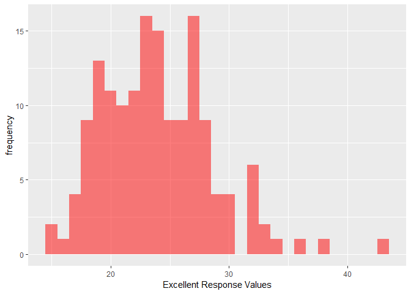

HW2 p8105 James Dalgleish jld2227
================
James Dalgleish
September 27, 2018

#### Problem 1

Instructions(I'm choosing to include these to make it a bit easier to grade): "Read and clean the data; retain line, station, name, station latitude / longitude, routes served, entry, vending, entrance type, and ADA compliance. Convert the entry variable from character (YES vs NO) to a logical variable (the ifelse or recode function may be useful)."

``` r
subway_data = read_csv("./problem1/NYC_Transit_Subway_Entrance_And_Exit_Data.csv") %>%
  janitor::clean_names() %>% 
  select(c("line", "station_name", "station_latitude", "station_longitude",
           starts_with("route"), "entry", "vending", "ada")) %>% 
  mutate(entry = recode(entry, "YES" = TRUE, "NO" = FALSE))
```

    ## Parsed with column specification:
    ## cols(
    ##   .default = col_character(),
    ##   `Station Latitude` = col_double(),
    ##   `Station Longitude` = col_double(),
    ##   Route8 = col_integer(),
    ##   Route9 = col_integer(),
    ##   Route10 = col_integer(),
    ##   Route11 = col_integer(),
    ##   ADA = col_logical(),
    ##   `Free Crossover` = col_logical(),
    ##   `Entrance Latitude` = col_double(),
    ##   `Entrance Longitude` = col_double()
    ## )

    ## See spec(...) for full column specifications.

``` r
subway_data 
```

    ## # A tibble: 1,868 x 18
    ##    line  station_name station_latitude station_longitu~ route1 route2
    ##    <chr> <chr>                   <dbl>            <dbl> <chr>  <chr> 
    ##  1 4 Av~ 25th St                  40.7            -74.0 R      <NA>  
    ##  2 4 Av~ 25th St                  40.7            -74.0 R      <NA>  
    ##  3 4 Av~ 36th St                  40.7            -74.0 N      R     
    ##  4 4 Av~ 36th St                  40.7            -74.0 N      R     
    ##  5 4 Av~ 36th St                  40.7            -74.0 N      R     
    ##  6 4 Av~ 45th St                  40.6            -74.0 R      <NA>  
    ##  7 4 Av~ 45th St                  40.6            -74.0 R      <NA>  
    ##  8 4 Av~ 45th St                  40.6            -74.0 R      <NA>  
    ##  9 4 Av~ 45th St                  40.6            -74.0 R      <NA>  
    ## 10 4 Av~ 53rd St                  40.6            -74.0 R      <NA>  
    ## # ... with 1,858 more rows, and 12 more variables: route3 <chr>,
    ## #   route4 <chr>, route5 <chr>, route6 <chr>, route7 <chr>, route8 <int>,
    ## #   route9 <int>, route10 <int>, route11 <int>, entry <lgl>,
    ## #   vending <chr>, ada <lgl>

###### Data description

Instruction: "Write a short paragraph about this dataset – explain briefly what variables the dataset contains, describe your data cleaning steps so far, and give the dimension (rows x columns) of the resulting dataset. Are these data tidy?"

Essentially, the dataset contains two character variables dening the subway line and station, two numeric (double) variables denoting geolocation (latitude and longitude), 11 variables denoting the routes (mostly populated with missing values) in a wide format, two logical TRUE/FALSE variables for entry and ada, and a character variable with values "YES" and "NO" variable for vending. The data is not tidy for at least the reasons that routes are in a wide format where the route is encoded in the column. This can be remedied with the gather function. As we'll see below, route1 was been encoded in mixed case(see the "E" and "e"?), which may mess up some downstream analysis as well.

The dataset contains 1868 rows and 18 columns. Data cleaning included reading the data into a tibble, selecting the necessary columns, converting the column names into a standard format, and converting the entry variable into a logical column.

``` r
skimr::skim( subway_data )
```

    ## Skim summary statistics
    ##  n obs: 1868 
    ##  n variables: 18 
    ## 
    ## -- Variable type:character ----------------------------------------------------------------------------------------------
    ##      variable missing complete    n min max empty n_unique
    ##          line       0     1868 1868   5  17     0       36
    ##        route1       0     1868 1868   1   2     0       24
    ##        route2     848     1020 1868   1   2     0       20
    ##        route3    1374      494 1868   1   2     0       18
    ##        route4    1547      321 1868   1   1     0       13
    ##        route5    1630      238 1868   1   1     0       12
    ##        route6    1741      127 1868   1   1     0        7
    ##        route7    1788       80 1868   1   2     0        7
    ##  station_name       0     1868 1868   4  39     0      356
    ##       vending       0     1868 1868   2   3     0        2
    ## 
    ## -- Variable type:integer ------------------------------------------------------------------------------------------------
    ##  variable missing complete    n mean   sd p0 p25 p50 p75 p100     hist
    ##   route10    1845       23 1868 3    0     3   3   3   3    3 <U+2581><U+2581><U+2581><U+2587><U+2581><U+2581><U+2581><U+2581>
    ##   route11    1845       23 1868 7    0     7   7   7   7    7 <U+2581><U+2581><U+2581><U+2587><U+2581><U+2581><U+2581><U+2581>
    ##    route8    1820       48 1868 2.98 1.94  1   1   4   5    5 <U+2587><U+2581><U+2581><U+2581><U+2581><U+2582><U+2581><U+2587>
    ##    route9    1840       28 1868 2.54 1.17  2   2   2   2    5 <U+2587><U+2581><U+2581><U+2581><U+2581><U+2581><U+2581><U+2582>
    ## 
    ## -- Variable type:logical ------------------------------------------------------------------------------------------------
    ##  variable missing complete    n mean                      count
    ##       ada       0     1868 1868 0.25 FAL: 1400, TRU: 468, NA: 0
    ##     entry       0     1868 1868 0.94 TRU: 1753, FAL: 115, NA: 0
    ## 
    ## -- Variable type:numeric ------------------------------------------------------------------------------------------------
    ##           variable missing complete    n   mean    sd     p0    p25    p50
    ##   station_latitude       0     1868 1868  40.73 0.07   40.58  40.69  40.73
    ##  station_longitude       0     1868 1868 -73.94 0.057 -74.03 -73.99 -73.96
    ##     p75   p100     hist
    ##   40.77  40.9  <U+2582><U+2582><U+2585><U+2587><U+2587><U+2582><U+2583><U+2582>
    ##  -73.91 -73.76 <U+2583><U+2587><U+2585><U+2583><U+2582><U+2581><U+2581><U+2581>

``` r
subway_data %>% 
  select(starts_with( "route" )) %>%
  sapply(., table)
```

    ## $route1
    ## 
    ##   1   2   3   4   5   6   7   A   B   C   D   e   E   F  FS   G  GS   H 
    ## 146 138  32  61   7 113  70 273 193  47  52   1  75 177   7  50  16  12 
    ##   J   L   M   N   Q   R 
    ##  93  74  53 101   6  71 
    ## 
    ## $route2
    ## 
    ##   1   2   3   4   5   B   C   D   E   F  FS   G   H   J   L   M   N   Q 
    ##  11  43  42  27 121  35 190 120  24  26   1  21   1  20  26  59  32 103 
    ##   R   Z 
    ##  75  43 
    ## 
    ## $route3
    ## 
    ##  1  3  4  5  6  7  C  D  E  F FS  G  J  M  N  Q  R  Z 
    ##  3 43 31 20 29  2 35  4 76 75  4  2 21 46  3 27 49 24 
    ## 
    ## $route4
    ## 
    ##  1  2  4  5  6  7  D  L  M  N  Q  R  Z 
    ## 21 17 28 15 16  7 35 11 55 27  3 60 26 
    ## 
    ## $route5
    ## 
    ##  1  2  3  4  5  6  7  E  N  Q  R  Z 
    ## 17 41 17 12 28 23 37  6 14 23  5 15 
    ## 
    ## $route6
    ## 
    ##  2  3  5  6  F  Q  R 
    ##  5 41 12 26  6 14 23 
    ## 
    ## $route7
    ## 
    ##  3  4  6 GS  M  R  S 
    ##  5 20 12  1  6 14 22 
    ## 
    ## $route8
    ## 
    ##  1  4  5 
    ## 23  5 20 
    ## 
    ## $route9
    ## 
    ##  2  5 
    ## 23  5 
    ## 
    ## $route10
    ## 
    ##  3 
    ## 23 
    ## 
    ## $route11
    ## 
    ##  7 
    ## 23

Putting the wide format into long could aid analysis and can be done with a simple gather command. We'll also get rid of names that appear to be the same, but differ only on case. There are stations with FS and GS lines, but which might seem like more than one line in a single observation, but they are distinct lines if one looks an MTA licensed site: <https://moveonmap.com/nyc/lnG_GS_FS/> If they were F and S incorrectly noted in the same row, we could consider using separate\_rows() to fix that. We'll use the table function to show that we've now fixed the lower and upper case e.

``` r
subway_data_long = subway_data %>% 
  #others may call this route name rather than train.
  #I simply used a different nomenclature, but the logic is the same.
  gather(key = "route_number", value = "train", route1:route11) %>% 
  mutate(train = tolower(train)) #This fixes the lower case e.
subway_data_long #display the dataframe.
```

    ## # A tibble: 20,548 x 9
    ##    line  station_name station_latitude station_longitu~ entry vending ada  
    ##    <chr> <chr>                   <dbl>            <dbl> <lgl> <chr>   <lgl>
    ##  1 4 Av~ 25th St                  40.7            -74.0 TRUE  YES     FALSE
    ##  2 4 Av~ 25th St                  40.7            -74.0 TRUE  YES     FALSE
    ##  3 4 Av~ 36th St                  40.7            -74.0 TRUE  YES     FALSE
    ##  4 4 Av~ 36th St                  40.7            -74.0 TRUE  YES     FALSE
    ##  5 4 Av~ 36th St                  40.7            -74.0 TRUE  YES     FALSE
    ##  6 4 Av~ 45th St                  40.6            -74.0 TRUE  YES     FALSE
    ##  7 4 Av~ 45th St                  40.6            -74.0 TRUE  YES     FALSE
    ##  8 4 Av~ 45th St                  40.6            -74.0 TRUE  YES     FALSE
    ##  9 4 Av~ 45th St                  40.6            -74.0 TRUE  YES     FALSE
    ## 10 4 Av~ 53rd St                  40.6            -74.0 TRUE  YES     FALSE
    ## # ... with 20,538 more rows, and 2 more variables: route_number <chr>,
    ## #   train <chr>

``` r
subway_data_long %>% 
  pull(train) %>% 
  table()
```

    ## .
    ##   1   2   3   4   5   6   7   a   b   c   d   e   f  fs   g  gs   h   j 
    ## 221 267 203 184 228 219 139 273 228 272 211 182 284  12  73  17  13 134 
    ##   l   m   n   q   r   s   z 
    ## 111 219 177 176 297  22 108

####### Distinct stations

Instruction: "Answer the following questions using these data:

How many distinct stations are there? Note that stations are identified both by name and by line (e.g. 125th St A/B/C/D; 125st 1; 125st 4/5); the distinct function may be useful here. How many stations are ADA compliant? What proportion of station entrances / exits without vending allow entrance?"

We'll now select the columns of interest and limit to only the distinct rows, then count the number of distinct rows containing route number and train combinations.

``` r
subway_routes_trains <- subway_data_long %>%
  select("route_number", "train") %>%
  distinct() %>% 
  na.omit() %>% 
  arrange(route_number,train)
subway_routes_trains
```

    ## # A tibble: 107 x 2
    ##    route_number train
    ##    <chr>        <chr>
    ##  1 route1       1    
    ##  2 route1       2    
    ##  3 route1       3    
    ##  4 route1       4    
    ##  5 route1       5    
    ##  6 route1       6    
    ##  7 route1       7    
    ##  8 route1       a    
    ##  9 route1       b    
    ## 10 route1       c    
    ## # ... with 97 more rows

``` r
nrow(subway_routes_trains)
```

    ## [1] 107

There happen to be 107 distinct stations, according to the data.

####### Ada compliance

We will create an additional variable denoting if the station ada is compliant. There can be multiple entrances, only some of which are ada compliant. As a simple rule, a station is compliant if there is at least one station name/line combination with an ada compliant entrance, then it is ada compliant.

``` r
#data is read from the dataframe in long format.
ada_accessible_stations <- subway_data_long %>% 
  #Colums are selected from the dataframe.
  select("route_number", "train", "ada") %>% 
  #Those openings that are accessible are  filtered.
  filter(ada == TRUE) %>%
  #Those that have a distinct route number and name (train) are kept.
  distinct(route_number, train, .keep_all = TRUE) %>% 
  #Rows with missing values are omitted.
  na.omit %>% 
  #The dataframe is sorted by route number and train.
  arrange(route_number, train)
ada_accessible_stations
```

    ## # A tibble: 88 x 3
    ##    route_number train ada  
    ##    <chr>        <chr> <lgl>
    ##  1 route1       1     TRUE 
    ##  2 route1       2     TRUE 
    ##  3 route1       3     TRUE 
    ##  4 route1       4     TRUE 
    ##  5 route1       6     TRUE 
    ##  6 route1       7     TRUE 
    ##  7 route1       a     TRUE 
    ##  8 route1       b     TRUE 
    ##  9 route1       c     TRUE 
    ## 10 route1       d     TRUE 
    ## # ... with 78 more rows

####### Station entrances/exists that without vending which allow entry.

Instruction: "What proportion of station entrances / exits without vending allow entrance?" The original form "contains information related to each entrance and exit for each subway station in NYC."

So, we will use this format to answer a question about entrances. Careful verification through subsetting for duplicate locations reveals that this is the case. Even looking at the latitude and longitude of the entrance does not distinctly identify the station. In some cases, there is a different kind of entrance (elevator/escalator) or the station is located on a different corner of an intersection. Converting wide to long as before could mislead someone to thinking that there are more entrances than exist in cases where the entrance services multiple routes. Therefore, the way to solve this problem is simple... read the original data in with minimal processing, filter on the vending and entry criteria, then count the number of rows. Using the distinct function can prove again, that the rows are distinct.

``` r
subway_ent_exit_locations = read_csv(
  "./problem1/NYC_Transit_Subway_Entrance_And_Exit_Data.csv") %>%
  janitor::clean_names() #read data and clean names
```

    ## Parsed with column specification:
    ## cols(
    ##   .default = col_character(),
    ##   `Station Latitude` = col_double(),
    ##   `Station Longitude` = col_double(),
    ##   Route8 = col_integer(),
    ##   Route9 = col_integer(),
    ##   Route10 = col_integer(),
    ##   Route11 = col_integer(),
    ##   ADA = col_logical(),
    ##   `Free Crossover` = col_logical(),
    ##   `Entrance Latitude` = col_double(),
    ##   `Entrance Longitude` = col_double()
    ## )

    ## See spec(...) for full column specifications.

``` r
#The below gets the distinct entry and exit locations.
subway_ent_exit_locations %>% 
  distinct()  %>% 
  nrow()
```

    ## [1] 1868

``` r
#the below gets the total number of entry and exit locations.
subway_ent_exit_locations %>% 
  nrow()
```

    ## [1] 1868

``` r
#duplicated locations are listed below (alluded to in paragraph answer).
duplicated_locations<-subway_ent_exit_locations %>%
  filter(duplicated(entrance_location)) %>% 
  pull(entrance_location)
#duplicated stations are shown in this dataframe (mentioned in paragraph
#above).
duplicated_locations_subset<-subway_ent_exit_locations %>% 
  filter(entrance_location %in% duplicated_locations) %>% 
  arrange()
#filter the subway openings for enterable locations with vending.
enterable_novend <- subway_ent_exit_locations %>% 
  filter(.,vending == "NO" & entry == "YES") 
enterable_novend %>% 
  nrow() 
```

    ## [1] 69

``` r
#count the number of enterable locations with vending.
n_enterable_novend <- enterable_novend %>% 
  distinct() %>% 
  nrow() 
#divide the count of the enterable locations with vending by the total number of openings
enterable_novend_prop =  n_enterable_novend / nrow(subway_ent_exit_locations)
#get the number of openings without vending.
n_novend <- subway_ent_exit_locations %>% 
  filter(.,vending == "NO") %>% 
  nrow()
#get the proportion of stations that are enterable given there is no vending.
prop_enterable_of_novend = n_enterable_novend / n_novend
```

The number of distinct enterable subway entrances/exits without vending is therefore 69. The proportion of such stations out of the total is 0.0369379. If one wants the proportion of openings that are enterable of all the openings without vending (another way of looking at this question): 0.3770492.

Instruction: "Reformat data so that route number and route name are distinct variables. How many distinct stations serve the A train? How many are ADA compliant?"

First we'll tackle the number of distinct A train stations. We've done most of the work by using gather() earlier. The problem description's route name I have chosen to call train (the value argument in gather). I will change the name to make this clearer for the reader (from "train" to "route name").

``` r
subway_data_long_a = subway_data %>% 
  gather(key = "route_number",
  value = "route_name",route1:route11) %>% 
  mutate(line = tolower(line))   %>% 
  filter(route_name == "A") %>% 
  distinct(station_name,line) %>%
  arrange(station_name,line)
subway_data_long_a
```

    ## # A tibble: 60 x 2
    ##    line             station_name                 
    ##    <chr>            <chr>                        
    ##  1 liberty          104th St-Oxford Av           
    ##  2 liberty          111th St-Greenwood Av        
    ##  3 8 avenue         125th St                     
    ##  4 8 avenue         145th St                     
    ##  5 8 avenue         14th St                      
    ##  6 broadway-7th ave 168th St                     
    ##  7 8 avenue         168th St - Washington Heights
    ##  8 8 avenue         175th St                     
    ##  9 8 avenue         181st St                     
    ## 10 8 avenue         190th St                     
    ## # ... with 50 more rows

It becomes clear now that there are precicsely 60 stations that service the A train.

Finally, how many are ada compliant follows a nearly identical process using the filter function.

``` r
subway_data_long_ada = subway_data %>% 
  gather(key = "route_number", value = "route_name", route1:route11) %>% 
  filter(ada == TRUE) %>% 
  mutate(line = tolower(line))   %>% 
  distinct(station_name, line) %>%
  arrange(station_name, line)
subway_data_long_ada
```

    ## # A tibble: 84 x 2
    ##    line              station_name                 
    ##    <chr>             <chr>                        
    ##  1 lexington         125th St                     
    ##  2 lenox             135th St                     
    ##  3 white plains road 149th St-3rd Av              
    ##  4 8 avenue          14th St                      
    ##  5 8 avenue          168th St - Washington Heights
    ##  6 8 avenue          175th St                     
    ##  7 63rd street       21st St                      
    ##  8 broadway-7th ave  231st St                     
    ##  9 white plains road 233rd St                     
    ## 10 flushing          34 St Hudson Yards           
    ## # ... with 74 more rows

It becomes clear now that there are precicsely 84 stations where there is an accessible entrance. Assuming one entrance is sufficent for compliance per station, then this represents the number of accessible stations.

#### Problem 2

instruction: "Read and clean the Mr. Trash Wheel sheet:

*specify the sheet in the Excel file and to omit columns containing notes (using the range argument and cell\_cols() function) *use reasonable variable names *omit rows that do not include dumpster-specific data *rounds the number of sports balls to the nearest integer and converts the result to an integer variable (using as.integer)"

"Read and clean precipitation data for 2016 and 2017. For each, omit rows without precipitation data and add a variable year. Next, combine datasets and convert month to a character variable (the variable month.name is built into R and should be useful)."

I've chosen to read in the data, specify the sheet, columns, drop the total rows (which typically have NA in dumpster), and removed any row without a month that matches base-r's month names constants. This means that if the month isn't one of "January", "February", or any of the other ones, the row is removed. One line has an incorrect year (the 1/2/2017 entry). This, along with the empty yeared rows near the end of the table, as indicated by missmap, will be corrected by reassigning the year. lubridate::year() can be used instead of format() and as.integer(), I've chosen to use missmap to show that I've fixed the missing values correctly. read\_excel doesn't convert to a tibble, so I've chosen to do that for purposes of display.

``` r
trash_wheel_data <- readxl::read_excel(path = 
    "./problem2/HealthyHarborWaterWheelTotals2018-7-28.xlsx",
  sheet =  "Mr. Trash Wheel",
  range = readxl::cell_cols("A:N")) %>% #This limits to columns A:N,
  #which are the data columns
  janitor::clean_names() %>%  #converts colnames to snake case.
  drop_na(dumpster) %>% #removes all NA in dumpster
  filter( month %in% month.name) %>%  #filters those without a valid month.
  mutate( year = lubridate::year(date), #fixes the year variable to pull from the
          #date-- some of the year associated with the date were inaccurate.
    sports_balls = round(sports_balls) %>% #grabs the sports balls and rounds
            as.integer()) %>%  #converts rounded values from double to integer.
  as.tibble() #convert to tibble.
 trash_wheel_data #display the data.
```

    ## # A tibble: 285 x 14
    ##    dumpster month  year date                weight_tons volume_cubic_ya~
    ##       <dbl> <chr> <dbl> <dttm>                    <dbl>            <dbl>
    ##  1        1 May    2014 2014-05-16 00:00:00        4.31               18
    ##  2        2 May    2014 2014-05-16 00:00:00        2.74               13
    ##  3        3 May    2014 2014-05-16 00:00:00        3.45               15
    ##  4        4 May    2014 2014-05-17 00:00:00        3.1                15
    ##  5        5 May    2014 2014-05-17 00:00:00        4.06               18
    ##  6        6 May    2014 2014-05-20 00:00:00        2.71               13
    ##  7        7 May    2014 2014-05-21 00:00:00        1.91                8
    ##  8        8 May    2014 2014-05-28 00:00:00        3.7                16
    ##  9        9 June   2014 2014-06-05 00:00:00        2.52               14
    ## 10       10 June   2014 2014-06-11 00:00:00        3.76               18
    ## # ... with 275 more rows, and 8 more variables: plastic_bottles <dbl>,
    ## #   polystyrene <dbl>, cigarette_butts <dbl>, glass_bottles <dbl>,
    ## #   grocery_bags <dbl>, chip_bags <dbl>, sports_balls <int>,
    ## #   homes_powered <dbl>

Instruction: "Read and clean precipitation data for 2016 and 2017. For each, omit rows without precipitation data and add a variable year. Next, combine datasets and convert month to a character variable (the variable month.name is built into R and should be useful)." An import of both sheets followed by a merge is done below. We read the excel file, specify the 2017 sheet, then instruct the reader to skip the first two rows that don't contain meaningful rows. Following this, the column names are specified.

``` r
#I was instructed by a TA to put in some inline comments, for ease of grading.
precip_2017 <- readxl::read_excel(path = 
    "./problem2/HealthyHarborWaterWheelTotals2018-7-28.xlsx", 
    #This reads the excel sheet.
  sheet =  "2017 Precipitation", #This specifies sheet
  skip = 2, col_names = c("month", "tot_precip")) %>% 
  #skip rows w/o data, limit to a pair of columns
  na.omit() %>%  #get rid of any rows containing empty cells.
  as.tibble() %>% #This converts to tibble format
  mutate(year = 2017) #Here, we add a year variable.
#We follow the same steps for the 2016 dataset
precip_2016 <- readxl::read_excel(path = 
    "./problem2/HealthyHarborWaterWheelTotals2018-7-28.xlsx",
  sheet =  "2016 Precipitation", 
  skip = 2,
  col_names = c("month", "tot_precip")) %>% 
  na.omit() %>% 
  as.tibble() %>% 
  mutate(year = 2016)
#Below we combine datasets vertically.
precip_2017_2016 <- dplyr::bind_rows(precip_2016, precip_2017) %>% 
  mutate(month = month.name[month])
```

Below, we'll calculate the paragraph statistics, starting by getting the total weight (in tons) per year and taking the mean of that by year sum. We follow a similar process to calculate the sd and mean of the homes powered each year, but filter the 2014 year out as no measures were made. For the precipitation data, the column is pulled from the tibble and summed to a single number, while the median number.

``` r
avg_wt_removed_yr <- trash_wheel_data %>% 
  group_by(year) %>% #This converts the df to a df grouped by year.
  summarise(sum = sum(weight_tons)) %>% #gets the yearly tonnage
  pull(sum) %>%  #pulls out the tonnage sums by year as a vector.
  mean() #calculates the mean on the yearly weight sums.
homes_yr_sd <- trash_wheel_data %>%
  group_by(year) %>%
  summarise(sum = sum(homes_powered)) %>%
  filter(year != 2014) %>% 
  pull(sum) %>%  sd()
homes_yr_mean <- trash_wheel_data %>%
  group_by(year) %>%
  summarise(sum = sum(homes_powered)) %>%
  filter(year != 2014) %>% 
  pull(sum) %>%  mean()
prcp_17_tot <- precip_2017 %>% 
  pull(tot_precip) %>%
  sum()
med_sports_balls <- trash_wheel_data %>% 
  filter(year == 2016) %>% 
  pull(sports_balls) %>% 
  median()
```

Instruction:"Write a paragraph about these data; you are encouraged to use inline R. Be sure to note the number of observations in both resulting datasets, and give examples of key variables."

The number of observations in the trash wheel data was 285 and 24 observations in the precipitation data. The key variables might be the more reportable effects the intervention had on the environment, namely the average trash removed per year , 186.988 tons, or the postitive outcomes outside of trash removal, namely the average homes powered per year, 2987.6666667 homes along with it's minimal standard deviation 417.2256473 homes during years where this variable has a measured value (not 2014).

Instruction: " For available data, what was the total precipitation in 2017? What was the median number of sports balls in a dumpster in 2016?" The total precipitation in 2017 was 32.93 inches. The median number of sports balls was 26.

Problem 3
=========

"This problem uses the BRFSS data. DO NOT include this dataset in your local data directory; instead, load the data from the p8105.datasets package.

For this question:

format the data to use appropriate variable names; focus on the “Overall Health” topic exclude variables for class, topic, question, sample size, and everything from lower confidence limit to GeoLocation structure data so that responses (excellent to poor) are variables taking the value of Data\_value create a new variable showing the proportion of responses that were “Excellent” or “Very Good”"

We begin by importing the dataset by pulling the dataframe out of the p8105 datasets package, filtering by topic, limiting columns, and creating several specific response colummns from the response. A variable for the total of the very good and excellent columns is created.

``` r
brfss <- p8105.datasets::brfss_smart2010 %>% #Pulls dataframe out of package.
  janitor::clean_names() %>%  #Converts to snake case.
  filter(topic == "Overall Health") %>%  #Filters by overall health topoc.
  select(-class,-topic,-question,-sample_size,
         -(confidence_limit_low:geo_location)) %>% 
  #retains only needed columns
    spread(key = response,value=data_value) %>% 
  #converts the format to wide (resulting in the excellent and very good columns.
   janitor::clean_names() %>%
  #Cleans names again, which is necessary as new columns were created.
  mutate(proportion_ex_very_good = excellent + very_good / (excellent + fair + good + poor + very_good) ) #adds a column for the sum
#of the excellent and very good columns.
brfss %>%
  pull(proportion_ex_very_good)  #displays the resulting tibble.
```

    ##    [1] 28.23734 18.80869 24.39300 21.96600 26.90100 22.99800 21.51200
    ##    [8] 25.85165 22.47100 23.76563 32.24500 26.42100 32.68900 28.10500
    ##   [15] 26.21900 30.36000 29.72800 29.61832 20.52667 22.84900 20.35035
    ##   [22] 26.01732 27.22700 27.14635 21.79471 32.79900 28.29129 19.09960
    ##   [29] 32.24700 19.61300 30.05900 20.03400 22.35900 18.69361 18.68500
    ##   [36] 28.84400 27.81832 23.16164 19.05536 24.19800 27.43834 18.70330
    ##   [43] 21.39700 24.64900 23.85165 21.97137 20.10470 25.03133 23.19471
    ##   [50] 25.29900 20.36164 27.01100 24.31400 28.45936 36.85964 26.91968
    ##   [57] 24.21732 27.43200 24.89700 20.92800 25.06537 30.34865 38.04700
    ##   [64] 21.25764 26.18600 22.21800 21.77100 18.27300 25.38300 15.73033
    ##   [71] 19.41049 26.20859 25.70600 26.97662 20.61200 25.14400 20.28743
    ##   [78] 22.73734 19.38800 23.14500 24.10200 28.42268 32.09800 17.40800
    ##   [85] 20.82100 24.46800 23.58038 34.54665 25.99300 27.27638 27.36300
    ##   [92] 30.48400 27.54500 23.35235 14.90070 27.32700 23.89530       NA
    ##   [99] 33.17300 28.12800       NA 23.74200 18.00030 22.34800 19.77500
    ##  [106] 27.29740 28.18700 19.09100 27.38228 18.95700 17.02100 19.16164
    ##  [113] 23.13534 24.17463 21.03000 23.14500 26.15500 20.24565 18.57900
    ##  [120] 20.02332 19.37572 24.35800 28.49200 25.92500 21.07800 23.55000
    ##  [127] 25.49261 17.60300 22.05564 27.43800 29.23200 19.33600 25.97700
    ##  [134] 16.97000 18.08929 24.57200 23.89500 23.72300 22.72667 18.96873
    ##  [141] 20.35500 18.66800 32.94400 24.64166 43.56700 23.00400 24.80430
    ##  [148] 32.76963 22.74500 29.15800 24.15500 23.70000 21.04635 19.43600
    ##  [155] 21.40070 16.82368 25.85936 25.83000 24.56700 19.83400 24.62432
    ##  [162] 24.51031 28.75335 22.31000 14.23300 25.39400 27.40500 27.68600
    ##  [169] 30.22068 26.46663 34.06500 26.52500 30.35764 27.65536 20.54266
    ##  [176] 24.75100 20.34600 20.47400 23.31658 23.37200 21.82200 22.11700
    ##  [183] 27.51932 21.89660 30.17363 22.38400 19.90400 27.16200 24.31300
    ##  [190] 17.56100 20.05200 29.23043 23.09239 18.86600 23.77872 23.23467
    ##  [197] 24.34200 19.11600 25.29900 23.33400 28.90070 23.24000 30.64600
    ##  [204] 26.37762 23.17700 25.21900 24.49800 28.06563 19.70430 23.03800
    ##  [211] 27.48200 30.34865 21.32667 28.95300 20.73656 23.08100 16.41800
    ##  [218] 26.51800 22.44600 24.78961 18.25100 20.56763 23.72232 23.40270
    ##  [225] 26.03267 24.90100 31.23033 22.26164 25.22743 25.76900 25.08900
    ##  [232] 28.69800 32.74466 28.07000 28.74234 30.08900 22.61300 26.44200
    ##  [239] 29.15065 23.75035 24.00700 26.31800 20.39000 23.24800 19.14965
    ##  [246] 24.76900 28.60260 20.93766 20.11300 24.16800 24.69300 25.31200
    ##  [253] 15.65774 23.40631 21.98671 24.14600 16.57127 23.36200 24.87400
    ##  [260] 16.66374 23.90200 28.06700 19.28771 24.56400 22.07063 18.73734
    ##  [267] 25.54500 22.68200 23.51868 24.34735 24.13500 25.15864 23.08500
    ##  [274] 18.20500 21.94334 32.64166 22.62368 30.80460 32.13700 27.41968
    ##  [281] 24.41500 26.44000 26.74300 23.60400 22.49200 24.13100 20.66000
    ##  [288] 20.75974 26.63600 40.31768 22.10100 24.77300 30.08561 23.96200
    ##  [295] 24.98338 19.96663 20.94134 21.17363 13.47900 25.84965 24.46200
    ##  [302] 21.25300 20.00600 19.93900 23.25500 18.23576 22.75200 18.55400
    ##  [309] 25.04965 20.09900 20.38076 26.45743 20.30221 21.34639 22.63835
    ##  [316] 26.31627 22.51896 19.08945 18.44137 14.92764 25.37751 25.40452
    ##  [323] 23.84839 27.35241 25.36072 30.02798 25.96985 24.89257 24.85678
    ##  [330] 23.09157 30.90622 29.14205 20.45772 20.56985 18.36710 26.78557
    ##  [337] 24.02731 23.34824 16.41695 19.56519 22.39257 23.43043 21.34237
    ##  [344] 19.92631 18.63066 30.86774 19.87884 18.41357 26.92828 20.89318
    ##  [351] 17.20421 14.63133 21.35170 20.90120 19.37610 23.11827 23.95513
    ##  [358] 20.64068 19.61695 16.90090 21.68291 22.56680 21.63133 27.15176
    ##  [365] 19.67387 30.47412 32.00622 27.37789 24.09347 25.14804 28.37174
    ##  [372] 18.50592 26.52663 21.51767 30.89078 27.09058 26.85206 21.38894
    ##  [379] 18.92397 23.92229 18.28715 19.69157 28.86810 23.97387 23.06610
    ##  [386] 20.05879 14.53266 28.13735 20.62129 20.44770 19.35980 19.05105
    ##  [393] 17.90723 24.77054 23.11896 25.33567 13.37666 25.54905 20.33046
    ##  [400] 26.65377 22.83166 38.83400 13.26580 26.87851 29.17149 24.18693
    ##  [407] 23.87286 24.50080 23.60402 20.61795 30.31194 26.99579 29.47487
    ##  [414] 26.10663 25.82631 26.55915 23.44403 22.11827 19.89980 20.84874
    ##  [421] 20.82211 22.53367 21.63869 29.33803 30.95176 20.14102 18.97163
    ##  [428] 24.19196 24.38643 22.82663 18.55602 23.00692 18.63266 26.83567
    ##  [435] 20.89146 19.11394 23.33233 16.82791 15.01062 25.04171 27.45100
    ##  [442] 16.73848 24.82831 24.81827 18.01424 24.30483 23.10261 21.08114
    ##  [449] 23.33467 21.50622 20.85105 19.06245 20.13173 21.39217 22.43467
    ##  [456] 22.15306 22.33434 22.83066 19.17789 25.88392 18.75225 21.36647
    ##  [463] 26.44372 21.62129 28.04137 14.46821 23.65276 25.02430 23.64975
    ##  [470] 24.12261 19.83333 22.40120 28.07312 16.93166 21.15105 20.51595
    ##  [477] 18.75075 18.81093 21.81328 13.45327 19.84699 21.11960 20.83400
    ##  [484] 23.36985 22.65678 34.83668 22.36747 25.59357 26.32096 28.22269
    ##  [491] 21.66647 24.84639 21.93635 22.18956 25.88114 23.04237 22.95176
    ##  [498] 23.43970 24.56948 21.85944 20.04604 19.45779 22.94673 20.35235
    ##  [505] 15.49347 19.03735 18.52598 21.89859 23.17651 25.35200 23.02567
    ##  [512] 16.52833 22.52900 23.02200 24.63000 24.58971 24.40969 25.17872
    ##  [519] 17.95100 27.54500 19.48700 25.09029 24.77700 21.68100 24.21800
    ##  [526] 21.20931 23.55300 23.81000 30.92000 27.27938 27.16663 27.57000
    ##  [533] 24.36800 21.74000 26.74565 22.92967 20.19200 18.74034 28.51700
    ##  [540] 23.61600 24.93524 22.32600 26.24166 27.75800 20.20700 20.51532
    ##  [547] 22.31300 21.83167 22.29100 21.41758 22.87337 17.59730 26.23267
    ##  [554] 16.43300 19.81568 20.87300 20.87700 21.31500 19.42432 29.91259
    ##  [561] 23.55800 22.94635 12.93500 20.32100 17.13700 19.25465 24.93900
    ##  [568] 22.82368 28.23966 28.55200 27.02368 23.29770 24.32400 23.60260
    ##  [575] 19.40869 22.40200 17.36663 22.43100 22.01000 26.45235 33.05900
    ##  [582] 30.08500 22.76563 21.73233 27.18162 21.58639 18.84000 19.88238
    ##  [589] 22.18561 19.75564 22.69900 16.50130 23.03100 22.69840 15.82100
    ##  [596] 18.17572 19.37662 17.79700 19.45936 23.24400 18.01800 18.93500
    ##  [603] 17.90600 23.82132 19.67437 16.33766 20.33534 20.65035 22.95000
    ##  [610] 22.05500 31.64200 15.92000 21.32667 22.99139 25.96663 24.31900
    ##  [617] 23.84066 22.82500 25.30559 18.24000 21.52957 26.77400 24.18400
    ##  [624] 26.81100 27.25300 24.24134 19.11369 24.27237 22.26900 18.36064
    ##  [631] 19.04635 21.36900 24.66400 16.73976 28.50600 23.33600 19.60000
    ##  [638] 27.55736 29.35200 21.22400 15.57027 26.55500 24.68900 22.53800
    ##  [645] 16.75000 21.61300 17.45225 23.12667 25.13000 17.43500 20.63900
    ##  [652] 13.37700 21.26436 19.86800 21.12400 26.23500 25.61800 15.97473
    ##  [659] 26.33000 28.30600 25.10800 23.55400 19.62300 17.97100 19.78800
    ##  [666] 22.07263 18.21000 15.79100 19.72168 15.36274 20.20831 16.94000
    ##  [673] 19.34100 17.08500 23.13900 17.71331 17.73900 20.66064 21.73033
    ##  [680] 18.83534 16.13634 20.75600 22.56036 16.11100 20.99300 24.08639
    ##  [687] 22.52400 16.46500 18.24300 27.09800 17.26700 24.12533 21.85400
    ##  [694] 26.47800 21.91500 21.54845 17.29500 23.60170 25.12200 26.42933
    ##  [701] 20.64735 24.03666 18.11200 20.73700 21.28300 25.87500 21.82268
    ##  [708] 22.15200 20.80800 20.95175 18.03377 23.38072 19.40669 27.43200
    ##  [715] 26.04100 26.04434 20.56336 23.30800 18.89239 27.52557 24.04700
    ##  [722] 22.29000 20.98800 23.29439 27.74200 23.09721 20.59900 19.86436
    ##  [729] 17.62800 13.71131 23.47862 23.43900 21.36164 22.85564 18.17938
    ##  [736] 21.16700 15.90700 20.13900 11.80600 21.18362 20.84500 23.49530
    ##  [743] 17.58800 18.43300 23.82800 22.99830 25.81532       NA 17.57600
    ##  [750] 27.03133 16.96873 22.00470 16.22368 25.32600 15.70869 21.30641
    ##  [757] 24.36136 28.82643 25.58000 25.08739 27.86400 24.17800 29.17000
    ##  [764] 26.41900 23.95500 25.76963 28.23600 21.54200 23.86563 16.97700
    ##  [771] 27.28400 20.95764 24.90400 24.85400 26.01231 32.83000 23.71369
    ##  [778] 19.05700 29.05700 21.84800 28.12533 30.11300 19.19700 18.09171
    ##  [785] 19.19129 22.89200 23.18400 23.96200 17.25836 20.80600 21.08500
    ##  [792] 22.88700 23.73666 18.20900 20.09800 24.18961 20.55500 20.45700
    ##  [799] 12.90600 17.63800 19.81732 23.55500 23.71100 24.09200 26.60230
    ##  [806] 21.34565 24.09640 18.42232 26.95600 25.69300 27.27600 26.73734
    ##  [813] 25.25636 25.48038 20.45000 21.55135 28.53400 26.23866 21.40100
    ##  [820] 26.65300 23.41441 32.46300 29.16036 28.24200 20.62700 21.27300
    ##  [827] 28.46600 25.34500 16.70900 22.59000 17.71732 21.90160 23.22300
    ##  [834] 27.56036 17.36900 17.35100 19.20800 23.64300 19.39700 22.67500
    ##  [841] 17.58800 26.97237 25.51658 20.06300 20.36500 17.32700 20.62667
    ##  [848] 16.76064 21.79900 21.34200 19.76600 19.37600 15.75800 26.93900
    ##  [855] 29.84000 31.60300 17.39770 25.95400 27.34400 25.18500 23.78400
    ##  [862] 19.38300 25.17037 24.82700 17.75165 23.09200 30.89000 26.98338
    ##  [869] 29.07300 28.26900 28.33566 22.60130 24.97000 23.07400 21.00330
    ##  [876] 25.14434 22.57473 23.02567 16.76326 29.95900 24.96064 20.69870
    ##  [883] 26.36300 29.42800 20.73433 17.62900 26.05400 23.97700 17.63233
    ##  [890] 21.02100 26.61800 19.04900 19.05000 24.59670 27.60500 19.00300
    ##  [897] 21.81900 19.45900 22.05000 29.12300 19.15900 20.95764 26.32800
    ##  [904] 21.42900       NA 22.80731 18.65200 20.41500 23.10200 22.75035
    ##  [911] 18.99660 19.28900 22.00900 25.87000 21.63866 22.56100 26.76500
    ##  [918] 20.35500 15.50270 16.33700 23.99200 18.89800       NA 19.86737
    ##  [925] 27.50800 20.62100 28.07337 20.21200 23.31041 20.74565 20.78300
    ##  [932] 22.39200 16.84735 23.08829 25.33700 22.27500 20.11200 32.55300
    ##  [939] 16.41100 20.55275 27.01169 20.51900 25.40800 21.49400 26.56400
    ##  [946] 26.40500 27.69960 26.02000 39.98929 20.36763 22.97800 20.85300
    ##  [953] 28.90100 23.86700 20.46900 21.47638 25.29000 25.16600 19.59570
    ##  [960] 20.96164 22.00800 20.44535 18.48400 11.95375 26.17263 20.64900
    ##  [967] 17.65800 22.24000 18.96637 17.20000 22.06436 15.29870 19.24865
    ##  [974] 16.16600 21.48700 19.46200 23.88100 19.93766 12.98629       NA
    ##  [981] 22.22533 20.85800 17.77600 18.93100 23.49700 23.92300 17.18800
    ##  [988]       NA 18.16074 28.79400 18.95500 22.58529 22.90000 30.50230
    ##  [995] 20.45135 26.34066 28.02400 24.53634 29.52800 25.56800 24.68400
    ## [1002] 27.45564 24.13100 27.37762 24.48300 28.40841 25.13534 26.77400
    ## [1009] 20.91842 26.94100 16.83900 21.70000 19.72567 26.53666 19.02032
    ## [1016] 18.39200 19.79570 22.68200 16.20869 25.63700 22.82700 18.60400
    ## [1023] 13.38500 22.79800 22.13300 23.13300 18.32422       NA       NA
    ## [1030] 21.12800 22.19600 17.90000 23.38300 14.71968 20.01900 22.13167
    ## [1037] 27.02700 23.41832 21.31600 24.71900 21.26426 29.08400 24.86100
    ## [1044] 17.10100 26.67828 19.64100 28.70900 23.37400 24.63900 20.33200
    ## [1051] 24.84300 24.24200 24.37237 23.34400 20.32700 18.81900 20.25936
    ## [1058] 21.03167 24.11542 30.11700 26.77700 24.18661 17.80800 19.50100
    ## [1065] 21.80700 22.40700 18.38400 22.16963 27.49900 22.53267 15.00531
    ## [1072] 18.79530 17.41100 29.58300 10.86737 16.45400 25.52557 20.15700
    ## [1079] 17.51000 15.69329 16.44334 19.34100 23.08428 18.93300 16.93100
    ## [1086] 21.36200 30.06300 21.85536 26.25135 20.64500 31.79540 28.49700
    ## [1093] 29.62667 27.35700 25.50500 23.57000 19.20641 23.69970 19.77900
    ## [1100] 26.19700 20.07562 24.19239 30.70100 28.24800 23.83100 24.11259
    ## [1107] 22.84166 29.57237 21.03566 17.49700 23.27137 24.47063 20.61200
    ## [1114] 14.52557 20.48800 15.63300 22.12700 18.81182 25.71800 20.84800
    ## [1121] 19.47400 20.91600 24.32700 19.40260 19.41400 18.81400 17.28939
    ## [1128] 21.09100 22.46700 24.85225 17.14700 19.81900 20.12400 23.49970
    ## [1135] 16.98100 21.61700 16.13900 17.84575 27.83800 20.84269 30.23100
    ## [1142] 15.98400 25.82432 23.45600 18.02200 25.25500 16.67000 21.96800
    ## [1149] 19.83834 21.31459 23.28400 26.89800 25.15200 25.29800 22.91200
    ## [1156] 18.86700 33.82877 25.92900 18.53367 18.58500 17.65055 18.62677
    ## [1163] 29.53956 21.27700 23.74200 28.58639 18.40700 20.88100 20.76900
    ## [1170] 25.69940 20.71700 19.53400 22.01469 15.76900 17.77373 18.76700
    ## [1177] 24.71269 18.36000 18.21200 19.04600 17.96136 17.87800 25.05165
    ## [1184] 27.21000 13.38671 22.64356 26.07700 18.46663 22.24400 22.34134
    ## [1191] 22.14800 16.64000 19.48639 15.38739 18.22900 18.75836 19.49139
    ## [1198] 21.44600 19.97528 22.32000 22.54600 23.43700 25.29600 21.76464
    ## [1205] 24.92500 14.11400 20.36500 24.59200 16.91732 22.13734 20.08100
    ## [1212] 25.14034 20.33666 23.70941 19.05300 32.97200 16.37600 24.23200
    ## [1219] 19.77100 23.43100 19.92800 19.50200 23.44166 17.69600 21.10700
    ## [1226] 25.74665 24.14535 20.34800 22.84166 19.10430 20.80300 17.44100
    ## [1233] 21.66236 23.17373 30.70600 20.64300 20.99171 17.28500 25.10000
    ## [1240] 25.95135 14.98318 25.08500 25.24500 24.71400 24.99700 28.75500
    ## [1247] 26.25100 27.17562 27.72600 31.49400 20.07900 31.80700 17.99600
    ## [1254] 25.00000 23.84800 23.81700 26.36937 20.95536 21.16464 20.15900
    ## [1261] 21.24034 24.38700 18.97137 20.22700 17.77700 23.64300 23.07200
    ## [1268] 22.98200 18.29870 17.80741 16.07200 21.33700 22.32700 16.46963
    ## [1275] 24.71600 17.23243 17.09600 17.15700 13.56200 16.81732 19.48100
    ## [1282] 19.86164 20.73766 17.56400 19.16800 20.26200 21.24134 17.74500
    ## [1289] 22.31200 21.03400 19.65300 24.72633 20.32200 28.29071 22.59600
    ## [1296] 24.59970 24.09100 24.20700 20.46737 28.70000 27.30641 24.32200
    ## [1303] 30.36054 22.77200 25.67500 24.78600 19.30900 30.76937 22.57700
    ## [1310] 26.94200 25.16200 26.84835 14.46863 22.88561 19.02700 28.16527
    ## [1317] 32.61700 29.46800 20.38200 27.96700 28.34765 26.78500 21.08000
    ## [1324] 18.22032 23.17273 23.40300 17.29400 19.86100 23.58661 26.00400
    ## [1331] 18.83133 24.65200 22.09129 23.83800 16.97772 18.52432 24.62700
    ## [1338] 20.27100 16.66863 14.61431 20.73367 18.79371 27.93000 22.07600
    ## [1345] 21.45000 24.63300 23.09560 21.03200 25.83100 26.48038 19.88100
    ## [1352] 22.62358 26.97800 30.17562 27.46164 26.40800 24.35736 21.90800
    ## [1359] 15.86100 24.42967 19.47700 16.57400 24.04200 26.18961 20.92800
    ## [1366] 26.93556 29.67500 22.56100 18.76637 19.24266 26.87662 18.69760
    ## [1373] 20.95500 19.33357 25.19400 22.71858 17.77662 23.76136 18.81300
    ## [1380] 17.43057 28.19039 24.91700 24.41200 14.85235 16.14900 24.83267
    ## [1387] 24.32767 16.30300 29.40440 22.32833 14.73200 18.58138 23.25100
    ## [1394] 21.91700 19.66300 20.34735 20.89300 15.15200 29.21400 17.52600
    ## [1401] 18.52400 27.21932 23.52667 31.48000 15.10200 25.44400 24.05500
    ## [1408] 19.19900 24.30300 19.15500 19.34600 13.20100 25.16800 17.02767
    ## [1415] 21.39039 21.36164 14.30900 23.30040 17.79100 23.67000 18.24800
    ## [1422] 25.78138 23.19061 27.39660 25.68062 19.62757 19.70500 26.81932
    ## [1429] 26.13033 21.83000 23.19500 23.95375 21.09940 21.53800 35.54865
    ## [1436] 21.03300 30.84665 31.55700 22.63267 20.00500 24.07662 23.17738
    ## [1443] 18.39400 23.94034 22.11031 14.85200 23.75000 26.28472 17.37227
    ## [1450] 18.69700 19.90969 24.25100 17.85225 20.41431 25.27700 30.30700
    ## [1457] 17.89500 21.15636 27.80600 23.43534 20.28800 22.09439 16.46064
    ## [1464] 18.11932 18.95000 20.26963 21.86537 24.82500 17.40330 20.32200
    ## [1471] 28.06264 22.19339 25.05800 20.63200 20.65700 21.33900 16.89730
    ## [1478] 17.43634 24.19100 16.33524 21.72200 25.68961 20.19039 26.99239
    ## [1485] 20.74234 29.20400 23.20270 30.55800 21.99800 23.53100 22.24735
    ## [1492] 12.64266       NA 20.36226 26.39800 20.44044 23.07562 23.38500
    ## [1499] 22.58600 19.03700 16.85325 12.70320 24.66000 21.52600 26.42967
    ## [1506] 22.59500 16.83834 26.37600 23.16900 29.23500 25.54600 35.15335
    ## [1513] 23.22500 30.96064 19.45135 26.92000 20.88800 24.48700 23.27100
    ## [1520] 25.57037 22.68500 24.32000 19.96900 22.17000 19.83900 15.58571
    ## [1527] 24.37900 21.96100 20.96100 18.89400 23.16036 19.57363 18.87728
    ## [1534] 22.84200 18.06573 21.12500 20.64900 19.39200 20.12900 16.97337
    ## [1541] 23.60000 16.74000 27.05475 26.96300 17.28500 26.84765 23.13666
    ## [1548] 21.47000 22.24675 21.31600 27.66600 21.14800 23.04166 20.37100
    ## [1555] 26.11400 18.56700 27.90800 29.38729 29.14800 24.15000 18.44535
    ## [1562] 25.18100 23.68700 31.05245 28.08800 27.50559 26.03000 20.28800
    ## [1569] 28.78600 22.09461 25.26963 28.61932 25.33544 28.35135 19.84635
    ## [1576] 19.42800 19.66236 22.07200 23.74300 26.87728 23.87600 24.54100
    ## [1583] 19.62867 20.76000 21.71868 15.28600 27.77300 20.75936 28.80140
    ## [1590] 19.70000 21.59129 19.39700 22.88028 18.83300 20.99361 22.34366
    ## [1597] 28.26400 22.05900 18.01469 13.44700 19.63934 27.87700 25.85836
    ## [1604] 17.89640 20.15900 18.71900 16.49970 16.96000 21.06500 24.71400
    ## [1611] 28.21300 26.93200 23.96200 20.86900 19.37200 11.39900 18.30731
    ## [1618] 19.01932 20.31431 20.33300 15.43033 23.99670 18.61431 18.39200
    ## [1625] 16.84066 21.53200 22.25800 24.99800 35.68400 31.37500 27.29000
    ## [1632] 26.83200 25.80600 23.90200 26.26600 17.01968 22.26700 21.11400
    ## [1639] 21.19540 24.06600 18.70240 24.96146 30.55000 23.83467 23.74334
    ## [1646] 20.77200 25.47200 24.43100 19.46800 22.29061 25.49540 17.14900
    ## [1653] 18.59100 19.48800 16.43200 21.19200 27.61600 25.99200 26.30559
    ## [1660] 22.35100 22.18200 17.85846 18.17300 15.25375 17.01832 14.07200
    ## [1667] 17.52132 16.53766 19.25800 16.42667 21.53700 29.01800 15.52500
    ## [1674] 20.41600 24.77700 17.65100 20.39300 21.38629 22.03067 16.10300
    ## [1681] 23.53834 19.90230 17.34134 22.93433 20.92300 28.04400 17.41000
    ## [1688] 22.96264 19.86364 23.89000 18.72300 19.80200 19.56400 18.58172
    ## [1695] 21.62933 20.56364 19.80700 15.47500 18.77662 22.51942 16.82468
    ## [1702] 15.90060 24.89261 26.95564 22.69700 26.87862 21.93800 21.78457
    ## [1709] 29.03966 24.73000 21.73400 23.92400 26.55700 23.34765 20.47500
    ## [1716] 27.30900 23.74366 26.62132 28.64166 34.68500 24.33467 19.10700
    ## [1723] 27.65335 25.94000 22.58800 24.27500 23.55800 21.55526 17.94100
    ## [1730] 19.20330 23.09830 27.72200 16.07173 19.94565 20.86500 18.68338
    ## [1737] 22.69271 24.33566 28.23033 30.70600 17.80731 22.79371 24.01259
    ## [1744] 20.76300 21.13566 23.71732 18.94600 20.10831 19.50300 18.34166
    ## [1751] 19.23934 22.64400 22.79161 18.61568 20.12100 21.81700 25.12100
    ## [1758] 21.22500 20.14366 17.66500 19.87600 14.05400 18.56200 24.19740
    ## [1765] 17.48400 15.40741 21.35035 26.88700 21.62933 26.62500 17.12767
    ## [1772] 25.18400 20.30931 22.92200 22.63267 16.63500 24.16800 20.77200
    ## [1779] 19.48761 26.03067 25.38328 22.88362 17.11300 22.95100 18.09900
    ## [1786] 15.47572 22.18661 21.21500 18.88600 20.67800 22.84565 24.64266
    ## [1793] 27.43133 26.66300 26.34100 37.64000 21.93467 24.78600 27.08739
    ## [1800] 23.24865 27.21600 19.15936 24.18062 23.72368 24.93400 24.03433
    ## [1807] 20.81231 24.56763 22.61868       NA 24.56064 21.99960 21.42900
    ## [1814] 18.75500 18.75800 21.51469 20.96436 16.48300 20.33100 13.72068
    ## [1821] 19.79600 22.33634 21.78100 19.20000 15.91300 21.09500 23.44200
    ## [1828] 29.32000 24.42000 27.61900 20.79000 17.38138 24.33267 28.76737
    ## [1835] 21.38000 23.80900 26.80800 21.77127 24.43766 18.84100 24.83100
    ## [1842] 25.43500 25.37562 24.71900 18.65100 28.46637 22.58700 31.31441
    ## [1849] 22.99700 25.61100 30.81400 29.88138 21.47000 24.34300 23.13834
    ## [1856] 24.22700 26.46863 18.54266 23.96500 19.44565 29.63500       NA
    ## [1863] 21.51100 15.94134 19.08000 19.77572 21.59800 24.44800 19.16226
    ## [1870] 14.99300 24.14300 21.25536  9.58000       NA 17.96827 21.47073
    ## [1877] 12.89300 18.75335 14.54100 16.92000 20.44034 23.98739 22.20400
    ## [1884] 16.31500 24.76700 25.38800 29.31100       NA 18.78600 18.02200
    ## [1891] 24.14400 15.22132 18.95700 19.38300 19.77662 21.96200 23.16800
    ## [1898] 23.98700 13.68561 15.32132 17.57100 21.59100 28.90000 26.18861
    ## [1905] 17.28452 20.11269 19.49600 22.10000 20.22500 25.03100 19.47600
    ## [1912] 24.57100 21.48800 17.72833 23.44900 16.36800 17.37862 19.90969
    ## [1919] 23.51600 18.90800 16.69200 16.63866 27.31600 20.44400 16.19900
    ## [1926] 14.42000 16.64334 16.34500 19.57337 13.99429 22.98529 20.49600
    ## [1933] 22.93634 28.06963 23.92300 25.86200 30.00200 31.05600 27.75335
    ## [1940] 29.69471 25.04500 23.10000 19.18400 22.63467 17.19500 24.55700
    ## [1947] 22.66663 20.35365 26.00700 26.47400 23.10300 25.44735 19.93400
    ## [1954] 24.36036 28.28600 23.84700 17.75300 23.96900 24.29161 21.98800
    ## [1961] 20.07400 24.71100 14.23400 26.04700 23.08148 33.53900 19.38500
    ## [1968] 27.08400 17.87437 17.81300 17.97000 20.29300 17.55700 22.95365
    ## [1975] 20.07938 19.96100 21.16400 22.53200 16.98500 26.86364 15.22600
    ## [1982] 23.55900 14.73866 27.64366 34.42767 14.12400 25.17800 24.28800
    ## [1989] 20.06000 21.04144 20.15200 20.71059 14.61069 20.96800 16.75300
    ## [1996] 18.91700 21.49530 24.29900 22.12200 19.20600 19.57900 24.76763
    ## [2003] 24.82700 21.78700 22.82358 17.21159 21.28500 25.85500 23.66500
    ## [2010] 21.86100 26.50700 22.09100 21.95065 18.70800 32.90759 22.09800
    ## [2017] 27.41031 28.24300 24.78000 22.13000 22.98700 29.90731 23.11842
    ## [2024] 23.99700 24.37762 26.39970 16.79300 21.37572 27.01400 24.22767
    ## [2031] 19.73500 21.90100 21.36364 17.85900 17.57938 22.67700 22.73167
    ## [2038] 26.58861 26.18000 21.49800 24.95500 27.30340 19.33500 18.24400
    ## [2045] 23.84800 18.52300 19.83566 18.09100 18.73100 17.37300 23.49660
    ## [2052] 17.20000 19.80000 20.32900 20.48700 22.45736 20.87900 20.86600
    ## [2059] 19.83400 22.49300 23.80100 23.43534 19.39300 19.84835 29.39061
    ## [2066] 22.03300 27.29400 20.94500 24.32800 17.77037 21.71100       NA
    ## [2073] 23.92100 20.96436 18.40160 19.39600 19.63300 17.41300 23.81500
    ## [2080] 15.55100 15.74266 22.07300 12.06000 23.10300 22.50900 16.90280
    ## [2087] 24.06800 19.60931 18.69700 18.04300 21.36763 16.25075 21.26336
    ## [2094] 21.21700 15.17163 23.57562       NA 15.70200 19.91031 27.56963
    ## [2101] 25.34700 39.11300 23.00631 27.14500 26.39800 27.62843 20.57900
    ## [2108] 19.22843 18.28761 31.58000 26.26737 22.66300 20.34900 10.98428
    ## [2115] 24.27538 24.27300 20.95400 21.26464 20.65365 20.75964 14.51200
    ## [2122] 21.82300 17.07073 20.33000 22.23934

Instruction: "Using this dataset, do or answer the following:

How many unique locations are included in the dataset? Is every state represented? What state is observed the most? In 2002, what is the median of the “Excellent” response value? Make a histogram of “Excellent” response values in the year 2002. Make a scatterplot showing the proportion of “Excellent” response values in New York County and Queens County (both in NY State) in each year from 2002 to 2010." \#\#\#\#\#\# Number of unique locations in dataset The number of unique locations is obtained by selecting the locationdesc variable (containing locations more specific than state abbreviations) from the brfss dataset, filtering using the distinct command and calculating the number of rows in the single column dataframe of locations.

``` r
unique_locations <- brfss %>%
  select( locationdesc ) %>%
  distinct() %>%
  nrow()
unique_locations
```

    ## [1] 404

The states are obtained identically, with the exception that the locationabbr column is used. If the frequency is desired, one can utilize the table command to obtain counts of each unique locationabbr (state).

``` r
n_states <- brfss %>%
  select( locationabbr ) %>%
  distinct() %>%
  nrow() 
n_states
```

    ## [1] 51

``` r
all_states <- brfss %>%
  select( locationabbr ) %>%
  distinct() %>% 
  table() %>% 
  names()
all_states
```

    ##  [1] "AK" "AL" "AR" "AZ" "CA" "CO" "CT" "DC" "DE" "FL" "GA" "HI" "IA" "ID"
    ## [15] "IL" "IN" "KS" "KY" "LA" "MA" "MD" "ME" "MI" "MN" "MO" "MS" "MT" "NC"
    ## [29] "ND" "NE" "NH" "NJ" "NM" "NV" "NY" "OH" "OK" "OR" "PA" "RI" "SC" "SD"
    ## [43] "TN" "TX" "UT" "VA" "VT" "WA" "WI" "WV" "WY"

The most observed state can be obtained by sorting the table output with counts of each state in a decreasing order and obtaining the first five of them with the head() function.

``` r
most_observed_states <- brfss %>% 
  select( locationabbr ) %>% 
  table() %>% 
  sort(decreasing = T) %>% 
  head()
most_observed_states
```

    ## .
    ##  NJ  FL  NC  WA  MD  MA 
    ## 146 122 115  97  90  79

``` r
most_observed_state <- most_observed_states %>% 
  names() %>% .[1]
most_observed_state
```

    ## [1] "NJ"

To obtain the median value of excellent responses, filtering by year for 2002 happens from the wide-format data (created earlier with spread) and the excellent column is pulled, NA values removed, and the median value obtained from the column vector.

``` r
median_ex_2002  <- brfss %>% 
  filter(year == 2002) %>% 
  pull(excellent) %>% 
  na.omit() %>% 
  median()
```

The number of unique locations is 404, achieved by selecting distinct locations and counting the rows. We find that all 50 states and the district of columbia are observed by the distinct count of 51 and observing that all the states observed in "all\_states" contain only state or DC abbreviations. The most observed state is NJ. The median of excellent responses in 2002 was 23.6. A histogram of excellent responses in 2002 is observed before.

``` r
excel_hist <- brfss %>% 
  filter(year == 2002) %>% 
    drop_na(excellent) %>%   ggplot(data = .,
  aes(x = excellent)) +
    geom_histogram(alpha = 0.5, binwidth = 1, fill = "red") +
    xlab("Excellent Response Values") +
  ylab("frequency") 
print(excel_hist)
```

 "Make a scatterplot showing the proportion of “Excellent” response values in New York County and Queens County (both in NY State) in each year from 2002 to 2010." Here's a scatterplot displaying the response values by county (denoted by the color variable), over time (years along the x axis), with the response values as a Y variable. A fitting line has been added, showing that Queens has been increasing the number of excellent responses over time while New York has been clearly decreasing. This trend is new, starting in roughly 2005-6.

``` r
ggplot(data = brfss %>%
         filter(locationdesc %in%
          c("NY - Queens County","NY - New York County") &
            year >= 2002 &
            year <= 2010),
       aes(x = year,y = excellent,color = locationdesc
           )
) +
  geom_point(alpha = 0.5, size = 5) + 
  ylab("Excellent Response Values") +
  labs(color = "county") +
  theme_dark() +
  geom_smooth(se = F) 
```

    ## `geom_smooth()` using method = 'loess' and formula 'y ~ x'


